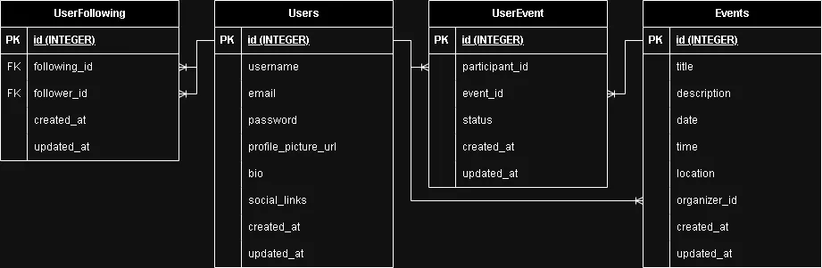

# Database Schema

## ERD diagram

## Table: User

| Field               | Type         | Constraints      | Description                              |
| ------------------- | ------------ | ---------------- | ---------------------------------------- |
| user_id             | SERIAL       | PRIMARY KEY      | Unique identifier for each user.         |
| username            | VARCHAR(50)  | UNIQUE, NOT NULL | User's chosen username.                  |
| email               | VARCHAR(100) | UNIQUE,          | User's email address.                    |
| password            | VARCHAR(60)  | NOT NULL         | Hashed password for user authentication. |
| profile_picture_url | VARCHAR(255) |                  | URL to the user's profile picture.       |
| bio                 | TEXT         |                  | User's biography or description.         |
| social_links        | VARCHAR(255) |                  | User's social media links or profiles.   |

## Table: Event

| Field        | Type         | Constraints               | Description                                           |
| ------------ | ------------ | ------------------------- | ----------------------------------------------------- |
| event_id     | SERIAL       | PRIMARY KEY               | Unique identifier for each event.                     |
| title        | VARCHAR(255) | NOT NULL                  | Title of the event.                                   |
| description  | TEXT         | NOT NULL                  | Description of the event.                             |
| date         | DATE         | NOT NULL                  | Date of the event.                                    |
| time         | TIME         | NOT NULL                  | Time of the event.                                    |
| location     | VARCHAR(255) | NOT NULL                  | Location of the event.                                |
| category     | VARCHAR(50)  | NOT NULL                  | Category or type of the event.                        |
| organizer_id | INTEGER      | FOREIGN KEY (user_id)     | User ID referencing the event organizer.              |
| created_at   | TIMESTAMP    | DEFAULT CURRENT_TIMESTAMP | Timestamp indicating when the event was created.      |
| updated_at   | TIMESTAMP    | DEFAULT CURRENT_TIMESTAMP | Timestamp indicating when the event was last updated. |

## Table: UserEvent (to represent RSVPs and user-event relationships)

| Field          | Type        | Constraints               | Description                                                        |
| -------------- | ----------- | ------------------------- | ------------------------------------------------------------------ |
| user_event_id  | SERIAL      | PRIMARY KEY               | Unique identifier for each user-event relationship.                |
| participant_id | INTEGER     | FOREIGN KEY (user_id)     | User ID referencing the user.                                      |
| event_id       | INTEGER     | FOREIGN KEY (event_id)    | Event ID referencing the event.                                    |
| status         | VARCHAR(50) |                           | User's status regarding the event (e.g., RSVP'd, attended).        |
| created_at     | TIMESTAMP   | DEFAULT CURRENT_TIMESTAMP | Timestamp indicating when the user-event relationship was created. |
| updated_at     | TIMESTAMP   | DEFAULT CURRENT_TIMESTAMP | Timestamp indicating when the event was last updated.              |

## Table: UserFollowing

| Field             | Type      | Constraints               | Description                                                       |
| ----------------- | --------- | ------------------------- | ----------------------------------------------------------------- |
| user_following_id | SERIAL    | PRIMARY KEY               | Unique identifier for each following relationship.                |
| follower_id       | INTEGER   | FOREIGN KEY (user_id)     | User ID who is following another user.                            |
| following_id      | INTEGER   | FOREIGN KEY (user_id)     | User ID who is being followed.                                    |
| created_at        | TIMESTAMP | DEFAULT CURRENT_TIMESTAMP | Timestamp indicating when the following relationship was created. |
| updated_at        | TIMESTAMP | DEFAULT CURRENT_TIMESTAMP | Timestamp indicating when the event was last updated.             |
